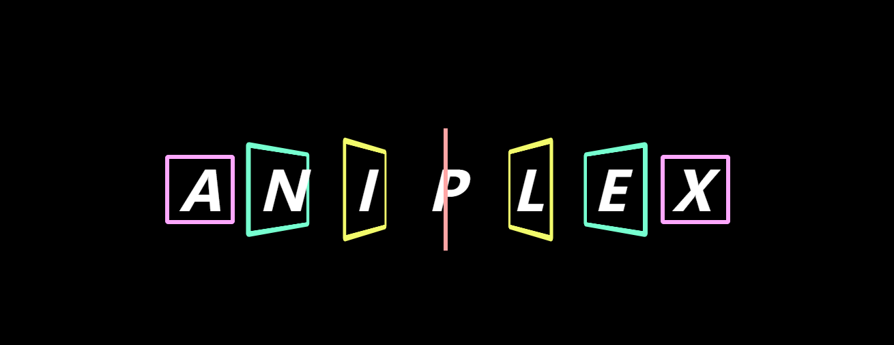

<h3 style="text-align:center;color:#d35400">INDEX</h3>

<a href="https://github.com/caoyus/a_project_a_day/tree/main/src/projects/P01-%E7%BA%AFCSS%E5%AE%9E%E7%8E%B0ANIPLEX%E5%8A%A8%E7%94%BB%E6%95%88%E6%9E%9C" style="color:#130f40;text-decoration:blink;">P01:纯 CSS 实现 ANIPLEX 动画效果</a>

